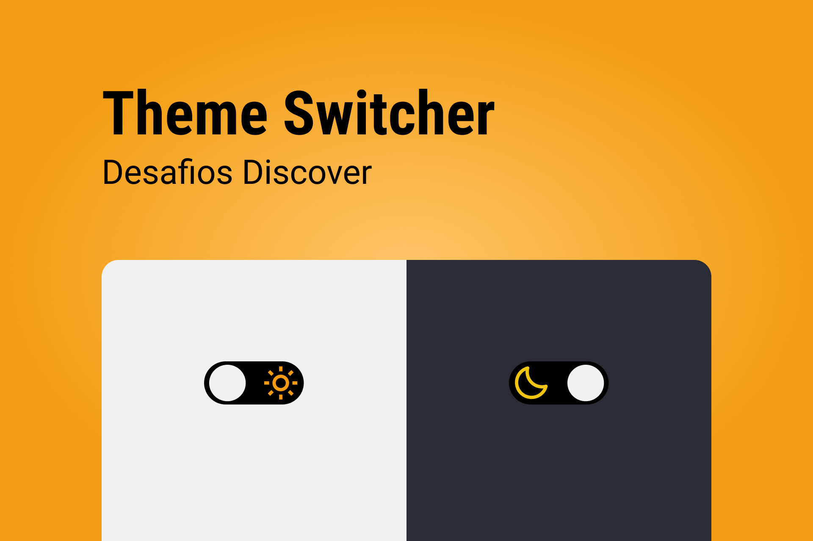

- arrumar o transition do sidebar

<h1 align="center">
  
</h1>

## Projeto

O projeto é uma página que contenha um toggle para alternar entre o tema dark e light.

### Requisitos para o desafio:

- Alterar o tema da página ao clicar no toggle;
- Ter uma transição entre um ícone e outro.

**_Se desafie também:_**

- Salvando o tema no Local Storage;
- Adicionar textos e alterar a cor conforme o tema alterne entre light e dark.

### Cores:

```css
:root {
  --dark: #292c35;
  --light: #f1f1f1;
  --label: #111;
}
```

### Tipo de fonte:

- font-family: Poppins
- font-weight: 400 e 500
- Você pode encontrar a fonte no [Google Fonts](https://fonts.google.com/)

## Layout

- O layout do projeto original encontra-se [aqui](https://www.figma.com/file/iOuqAlZvhAMkkfjCMFyc7Y/DD-%2F-Sidebar-Responsiva/duplicate).
- Você deve ter uma conta no [figma](https://www.figma.com) para obter acesso ao design.

**_Extras:_**

- Cores foram adicionadas ou modificadas;
- Alterar o tema, de acordo com o tema salvo no Local Storage;
- Remover tema do Local Storage.
